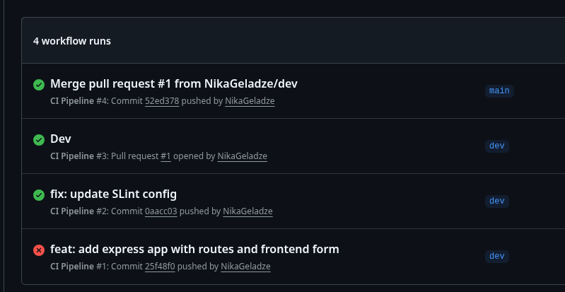
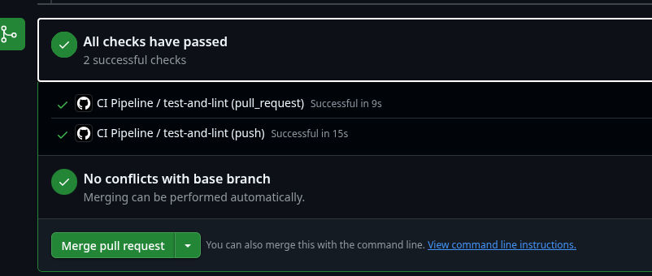
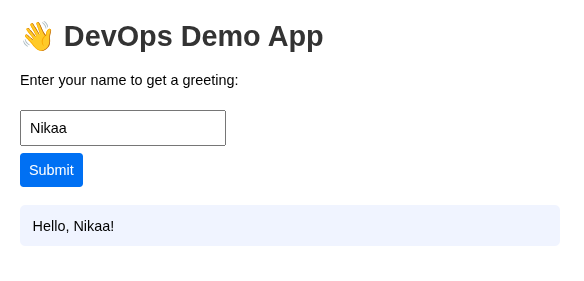
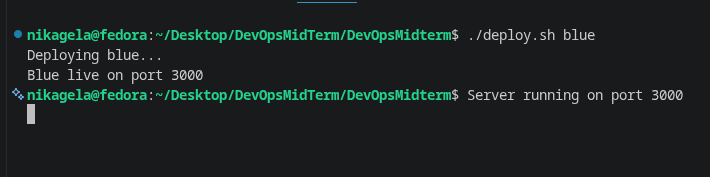
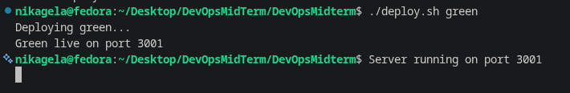
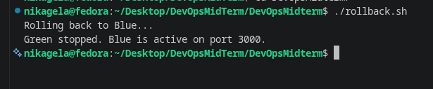
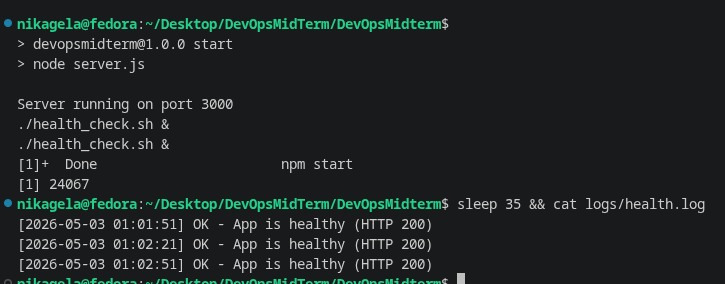

# DevOps Midterm Project — DevOpsMidterm

A fully automated DevOps pipeline demonstration built with Node.js and Express, featuring CI/CD, Infrastructure as Code, Blue-Green Deployment, and automated health monitoring.

**Repository:** [https://github.com/NikaGeladze/DevOpsMidterm](https://github.com/NikaGeladze/DevOpsMidterm)

---

## Tech Stack

| Tool              | Purpose                                       |
| ----------------- | --------------------------------------------- |
| Node.js + Express | Web application runtime and framework         |
| Jest + Supertest  | Unit testing                                  |
| ESLint            | Code linting                                  |
| GitHub Actions    | CI/CD pipeline                                |
| Bash Scripts      | IaC setup, deployment, rollback, health check |
| Git               | Version control (branches: `main`, `dev`)     |

---

## Project Structure

```
DevOpsMidterm/
├── public/
│   └── index.html          # Frontend form
├── .github/
│   └── workflows/
│       └── ci.yml          # GitHub Actions CI pipeline
├── app.js                  # Express application
├── server.js               # Server entry point
├── app.test.js             # Unit tests
├── setup.sh                # IaC — single-command environment setup
├── deploy.sh               # Blue-Green deployment script
├── rollback.sh             # Rollback script
├── health_check.sh         # Periodic health monitoring script
├── eslint.config.cjs       # ESLint v9 configuration
├── .gitignore
└── package.json
```

---

## CI/CD Workflow Diagram

```
Developer
    │
    ▼
  git push / Pull Request
    │
    ▼
┌─────────────────────────┐
│   GitHub Actions CI     │
│  ┌───────────────────┐  │
│  │  1. npm install   │  │
│  │  2. npm test      │  │
│  │  3. npm run lint  │  │
│  └───────────────────┘  │
└────────────┬────────────┘
             │ Pass ✅
             ▼
      Merge PR: dev → main
             │
             ▼
      ./deploy.sh blue        (Production on port 3000)
             │
      New version ready?
             │
             ▼
      ./deploy.sh green       (Staging on port 3001)
             │
      Issue found?
             │
      ┌──────┴──────┐
      │             │
      ▼             ▼
 ./rollback.sh   Promote Green
 (kill green,    to Production
  blue stays)
```

---

## Step-by-Step Setup Guide

### Prerequisites

- Linux/macOS machine (Fedora, Ubuntu, or similar)
- Git installed
- Internet connection

---

### Step 1 — Clone the Repository

```bash
git clone https://github.com/NikaGeladze/DevOpsMidterm.git
cd DevOpsMidterm
```

---

### Step 2 — Run the IaC Setup Script (Single Command)

This script installs Node.js, creates required directories, and installs all dependencies automatically:

```bash
chmod +x setup.sh
./setup.sh
```

**What it does:**

- Installs Node.js v20 via NodeSource
- Creates the `logs/` directory
- Runs `npm install` to install all dependencies

---

### Step 3 — Run Tests Locally

```bash
npm test
```

Expected output: all 3 tests pass.

---

### Step 4 — Run Linting

```bash
npm run lint
```

Silent output = no errors (ESLint v9 format).

---

### Step 5 — Start the Application

```bash
npm start
```

Open your browser at [http://localhost:3000](http://localhost:3000). Enter your name and click Submit to see the greeting.

---

### Step 6 — Blue-Green Deployment

**Deploy Blue (port 3000 — current production):**

```bash
./deploy.sh blue
```

**Deploy Green (port 3001 — new version):**

```bash
./deploy.sh green
```

Both versions run simultaneously. Blue serves production traffic while Green is validated.

**Rollback to Blue (if Green has issues):**

```bash
./rollback.sh
```

This kills the Green process and Blue continues serving on port 3000.

---

### Step 7 — Health Check Monitoring

Start the app and the health check monitor:

```bash
npm start &
./health_check.sh &
```

Wait 30 seconds, then view the log:

```bash
cat logs/health.log
```

The script polls `/health` every 30 seconds and logs the result with a timestamp.

---

## CI Pipeline — GitHub Actions

The pipeline is defined in `.github/workflows/ci.yml` and triggers automatically on every push or pull request to `main` or `dev`.

**Pipeline steps:**

1. Checkout code
2. Setup Node.js v20
3. Install dependencies (`npm install`)
4. Run tests (`npm test`)
5. Run linter (`npm run lint`)

---

## Screenshots

### ✅ CI Pipeline — All Runs

> GitHub Actions tab showing 4 workflow runs — 3 green, 1 red (first commit before ESLint fix)



---

### ✅ Pull Request — All Checks Passed

> PR from `dev` → `main` with both CI checks passing before merge



---

### ✅ Running Application

> App running at localhost:3000 — form submitted with name "Nikaa", response: "Hello, Nikaa!"



---

### ✅ Blue Deployment (port 3000)

> `./deploy.sh blue` — Blue environment deployed on port 3000



---

### ✅ Green Deployment (port 3001)

> `./deploy.sh green` — Green environment deployed on port 3001 simultaneously



---

### ✅ Rollback

> `./rollback.sh` — Green stopped, Blue remains active on port 3000



---

### ✅ Health Check Logs

> `health_check.sh` running every 30 seconds, logging HTTP 200 OK responses to `logs/health.log`



---

## Git Branching Strategy

| Branch | Purpose                                              |
| ------ | ---------------------------------------------------- |
| `main` | Production-ready code only, merged via PR            |
| `dev`  | Active development branch, all commits go here first |

All changes are committed to `dev`, then promoted to `main` via a Pull Request. The CI pipeline runs on both the push to `dev` and again on the PR to `main`.

---

## API Endpoints

| Method | Route       | Description                                        |
| ------ | ----------- | -------------------------------------------------- |
| GET    | `/`         | Serves the frontend HTML form                      |
| GET    | `/user/:id` | Dynamic route — returns user info by ID            |
| POST   | `/greet`    | Accepts `{ name }` and returns a greeting          |
| GET    | `/health`   | Health check endpoint — returns `{ status: "ok" }` |

---

## Scripts Reference

| Script       | Command             | Description                                     |
| ------------ | ------------------- | ----------------------------------------------- |
| Setup        | `./setup.sh`        | Full environment setup (single command)         |
| Deploy Blue  | `./deploy.sh blue`  | Start app on port 3000                          |
| Deploy Green | `./deploy.sh green` | Start app on port 3001                          |
| Rollback     | `./rollback.sh`     | Kill Green, Blue stays active                   |
| Health Check | `./health_check.sh` | Monitor app every 30s, log to `logs/health.log` |
